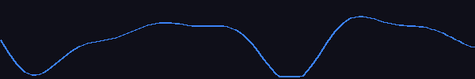
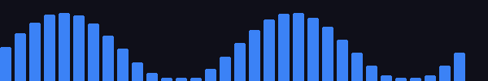
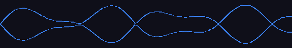
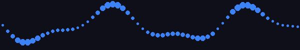

<div align="center">



# audio-pulse

**React audio recorder with real-time waveform visualization**

Record MP3 audio from the microphone, visualize live sound waves on a canvas,
and control recording state with a simple hook — fully typed with TypeScript.

[](https://www.npmjs.com/package/audio-pulse)
[](https://www.npmjs.com/package/audio-pulse)
[](https://bundlephobia.com/package/audio-pulse)
[](LICENSE)
[](https://www.typescriptlang.org)

[**Live Demo & Playground →**](https://audio-pulse-playground.vercel.app) · [Docs](https://audio-pulse-playground.vercel.app) · [npm](https://www.npmjs.com/package/audio-pulse) · [Report Bug](https://github.com/ashishvora1997/audio-pulse/issues)

</div>

---

## Features

- ✅ **Zero config** — one component, plug in and record
- 🎨 **5 built-in variants** — line, bars, mirror, dots, circle
- 🪝 **`useAudioRecorder` hook** — clean state management, no boilerplate
- 🔷 **TypeScript-first** — full types included, no `@types/` package needed
- 📦 **Tiny bundle** — built with tsup + esbuild, tree-shakeable ESM + CJS
- 🌐 **Cross-browser** — MP3 output via polyfill (Safari + Firefox support)
- 🎛️ **Fully customizable** — colors, size, line width, or bring your own canvas

---

## Variants

| Preview | Name | Description |
|---|---|---|
|  | `line` | Smooth bezier waveform — default |
|  | `bars` | Frequency bar chart |
|  | `mirror` | Waveform reflected top + bottom |
|  | `dots` | Particle dot wave |
|  | `circle` | Radial circular waveform |

> 🎮 **Try all variants live →** [audio-pulse-playground.vercel.app](https://audio-pulse-playground.vercel.app)

---

## Installation

```bash
npm install audio-pulse
# or
yarn add audio-pulse
# or
pnpm add audio-pulse
```

> **Peer dependencies** — `react >= 17` and `react-dom >= 17` must be installed in your project.

---

## Quick Start

Complete recorder with correct button visibility at every state.

**State flow:**

* `NONE` → **Start** only
* `START` (recording) → **Pause** + **Stop**
* `PAUSE` → **Resume** + **Stop**
* After stop → audio player + **Start Again**

> ⚠️ Keep `<AudioPulse>` always mounted — use `display: none` to hide it rather
> than conditionally rendering it. Unmounting tears down the internal audio
> contexts, which breaks "Start Again".

```tsx
import { useState } from 'react';
import AudioPulse, { useAudioRecorder, RecordState, AudioResult, VisualizerVariant } from 'audio-pulse';

export default function Recorder() {
  const { recordState, start, pause, stop, reset } = useAudioRecorder();
  const [audio, setAudio] = useState<AudioResult | null>(null);

  const handleStop = (result: AudioResult) => {
    setAudio(result);
  };

  const handleStartAgain = () => {
    setAudio(null);
    reset();
    setTimeout(start, 0);
  };

  return (
    <div style={{ maxWidth: 480, margin: '0 auto', padding: 24 }}>

      {/* Always mounted — hide with display:none, never unmount */}
      <div style={{ display: audio ? 'none' : 'block' }}>
        <AudioPulse
          state={recordState}
          onStop={handleStop}
          onError={(err) => console.error(err)}
          variant={VisualizerVariant.BARS}
          foregroundColor="#3b82f6"
          backgroundColor="#0f172a"
          lineWidth={2}
          height={80}
          style={{ borderRadius: 12, overflow: 'hidden', marginBottom: 16 }}
        />
      </div>

      <div style={{ display: 'flex', gap: 12, justifyContent: 'center' }}>

        {/* IDLE */}
        {recordState === RecordState.NONE && !audio && (
          <button onClick={start}>🎙 Start</button>
        )}

        {/* RECORDING */}
        {recordState === RecordState.START && (
          <>
            <button onClick={pause}>⏸ Pause</button>
            <button onClick={stop}>⏹ Stop</button>
          </>
        )}

        {/* PAUSED */}
        {recordState === RecordState.PAUSE && (
          <>
            <button onClick={start}>▶ Resume</button>
            <button onClick={stop}>⏹ Stop</button>
          </>
        )}

        {/* STOPPED — show player */}
        {audio && (
          <div style={{ display: 'flex', flexDirection: 'column', gap: 12, alignItems: 'center', width: '100%' }}>
            <audio controls src={audio.url} style={{ width: '100%' }} />
            <button onClick={handleStartAgain}>🎙 Start Again</button>
          </div>
        )}

      </div>
    </div>
  );
}
```

> ⚠️ **Always keep `<AudioPulse>` mounted.** Unmounting tears down the internal Web Audio contexts.
> Use `display: none` to hide it instead of conditional rendering.

---

## Props

### Core

| Prop | Type | Default | Description |
|---|---|---|---|
| `state` | `RecordStateType` | **required** | Current recording state |
| `onStop` | `(result: AudioResult) => void` | — | Called with audio data when recording stops |
| `onError` | `(error: string) => void` | — | Called when mic access is denied |
| `variant` | `VisualizerVariantType` | `'line'` | Visualizer style |

### Appearance

| Prop | Type | Default | Description |
|---|---|---|---|
| `foregroundColor` | `string` | `'#3b82f6'` | Waveform stroke / fill color |
| `backgroundColor` | `string` | `'transparent'` | Canvas background fill |
| `lineWidth` | `number` | `2` | Stroke width in px (line, mirror, circle) |
| `height` | `number` | `60` | Canvas height in px |
| `className` | `string` | `''` | CSS class on the outer wrapper |
| `style` | `CSSProperties` | `{}` | Inline style on the outer wrapper |
| `canvasStyle` | `CSSProperties` | `{}` | Inline style on the `<canvas>` |

### Audio Analysis

| Prop | Type | Default | Description |
|---|---|---|---|
| `smoothingTimeConstant` | `number` | `0.8` | Analyser smoothing 0–1. Lower = more reactive |
| `fftSize` | `number` | `512` | FFT size (power of 2). Lower = more movement |
| `barSkipBins` | `number` | `4` | `bars` only — skip DC offset bins (stops idle jumping) |
| `barSilenceThreshold` | `number` | `20` | `bars` only — min value 0–255 to render a bar |

### Custom Renderer

| Prop | Type | Description |
|---|---|---|
| `renderVisualizer` | `(ref: RefObject<HTMLCanvasElement>) => ReactNode` | Replace the default canvas entirely |

## `RecordState`

```ts
import { RecordState } from 'audio-pulse';

RecordState.START  // 'start'  — recording
RecordState.PAUSE  // 'pause'  — paused
RecordState.STOP   // 'stop'   — stopped, onStop fires
RecordState.NONE   // 'none'   — initial / reset
```
---

## `useAudioRecorder` Hook

```ts
const { recordState, start, pause, stop, toggle, reset } = useAudioRecorder();
```

| Return | Type | Description |
|---|---|---|
| `recordState` | `RecordStateType` | Current state |
| `start` | `() => void` | Start or resume recording |
| `pause` | `() => void` | Pause recording |
| `stop` | `() => void` | Stop and trigger `onStop` |
| `toggle` | `() => void` | Toggle START ↔ PAUSE |
| `reset` | `() => void` | Reset back to NONE |

**State machine:**

```
NONE ──start()──► START ──pause()──► PAUSE
                    │                  │
                    └────stop()────────┘
                              │
                            STOP
                              │
                         reset() → NONE
```

---

## Variants

```tsx
import { VisualizerVariant } from 'audio-pulse';

<AudioPulse variant={VisualizerVariant.LINE}   ... />  // smooth bezier wave (default)
<AudioPulse variant={VisualizerVariant.BARS}   ... />  // frequency bar chart
<AudioPulse variant={VisualizerVariant.MIRROR} ... />  // wave mirrored top + bottom
<AudioPulse variant={VisualizerVariant.DOTS}   ... />  // dot particle wave
<AudioPulse variant={VisualizerVariant.CIRCLE} ... />  // radial circular wave

// Or plain strings:
<AudioPulse variant="bars" ... />
```

---

## Types

All types exported directly from `audio-pulse` — no `@types/` package needed.

```ts
import type {
  AudioResult,
  RecordStateType,
  VisualizerVariantType,
  AudioPulseProps,
  UseAudioRecorderReturn,
} from 'audio-pulse';

// AudioResult — passed to onStop
interface AudioResult {
  blob: Blob;    // Raw MP3 Blob
  url:  string;  // Object URL — use in <audio src={url} />
  type: string;  // 'audio/mp3'
}
```

---

## Examples

### Light theme

```tsx
<AudioPulse
  state={recordState}
  onStop={handleStop}
  variant="mirror"
  foregroundColor="#3b82f6"
  backgroundColor="#f0f5ff"
  lineWidth={2}
  height={80}
  style={{ borderRadius: 8, overflow: 'hidden', border: '1px solid #b4c8e6' }}
/>
```

### Custom canvas renderer

```tsx
<AudioPulse
  state={recordState}
  onStop={handleStop}
  renderVisualizer={(ref) => (
    <div style={{ background: '#000', padding: 16, borderRadius: 8 }}>
      <canvas
        ref={ref}
        width={500}
        height={120}
        style={{ display: 'block', width: '100%' }}
      />
    </div>
  )}
/>
```

### Upload to server

```tsx
const handleStop = async (audio: AudioResult) => {
  const formData = new FormData();
  formData.append('file', audio.blob, 'recording.mp3');

  await fetch('/api/upload', {
    method: 'POST',
    body: formData,
  });
};
```

---

## Advanced — Raw Context Access

For fully custom visualizers, access the internal Web Audio API contexts directly:

```tsx
import {
  MediaStreamProvider,
  InputAudioProvider,
  AudioAnalyserProvider,
  useAudioAnalyser,
  useMediaStream,
} from 'audio-pulse';

function MyVisualizer() {
  const { analyser } = useAudioAnalyser();
  // analyser.getByteTimeDomainData(data) or
  // analyser.getByteFrequencyData(data) in a rAF loop

  const { start, stop, url, isStop } = useMediaStream();
  return <canvas id="my-canvas" />;
}

export default function App() {
  return (
    <MediaStreamProvider audio video={false}>
      <InputAudioProvider>
        <AudioAnalyserProvider smoothingTimeConstant={0.8} fftSize={512}>
          <MyVisualizer />
        </AudioAnalyserProvider>
      </InputAudioProvider>
    </MediaStreamProvider>
  );
}
```

---

## Browser Support

| Browser | Support |
|---|---|
| Chrome | ✅ Native |
| Edge | ✅ Native |
| Firefox | ✅ via polyfill |
| Safari | ✅ via polyfill |
| Chrome Android | ✅ Native |
| Safari iOS | ✅ via polyfill |

> **HTTPS required** — `getUserMedia` only works on secure origins (HTTPS or localhost).

---

## Contributing

Contributions, issues and feature requests are welcome.

1. Fork the repo
2. Create a branch — `git checkout -b feature/my-feature`
3. Commit — `git commit -m 'feat: add my feature'`
4. Push — `git push origin feature/my-feature`
5. Open a Pull Request

---

## License

MIT © [Ashish Vora](https://github.com/ashishvora1997)

---

<div align="center">

Made with ❤️ &nbsp;·&nbsp; [Live Demo](https://audio-pulse-playground.vercel.app) &nbsp;·&nbsp; [npm](https://www.npmjs.com/package/audio-pulse) &nbsp;·&nbsp; [GitHub](https://github.com/ashishvora1997/audio-pulse)

</div>