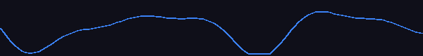
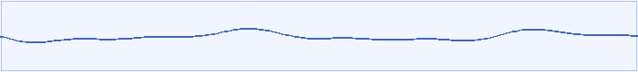

# 🎙️ audio-pulse

**React audio recorder** with real-time waveform visualization. Record MP3 audio from the microphone, visualize live sound waves on a canvas, and control recording state with a simple hook — fully typed with TypeScript.

[](https://www.npmjs.com/package/audio-pulse)
[](https://bundlephobia.com/package/audio-pulse)
[](LICENSE)

**Dark theme**



**Light theme**



---

- ✅ **Zero config** — one component, plug in and record
- 🎨 **Fully customizable** — colors, size, line width, or bring your own canvas renderer
- 🪝 **Hook included** — `useAudioRecorder` for clean state management
- 🔷 **TypeScript-first** — full types, no `@types/` package needed
- 📦 **Tiny bundle** — built with tsup + esbuild, tree-shakeable ESM + CJS
- 🌐 **Cross-browser** — MP3 output via `audio-recorder-polyfill` (Safari & Firefox)

---

## Installation

```bash
npm install audio-pulse
# or
yarn add audio-pulse
# or
pnpm add audio-pulse
```

> **Peer deps:** `react >= 17` and `react-dom >= 17` must already be in your project.

---

## Full Example

Complete recorder with correct button visibility at every state.

**State flow:**
- `NONE` → **Start** button only
- `START` (recording) → **Pause** + **Stop**
- `PAUSE` → **Resume** + **Stop**
- After stop → audio player + **Start Again**

> ⚠️ Keep `<AudioPulse>` always mounted — use `display: none` to hide it rather
> than conditionally rendering it. Unmounting tears down the internal audio
> contexts, which breaks "Start Again".

```tsx
import { useState } from 'react';
import AudioPulse, { useAudioRecorder, RecordState, AudioResult } from 'audio-pulse';

export default function Recorder() {
  const { recordState, start, pause, stop, reset } = useAudioRecorder();
  const [audio, setAudio] = useState<AudioResult | null>(null);

  const handleStop = (result: AudioResult) => {
    setAudio(result);
  };

  const handleStartAgain = () => {
    setAudio(null);           // hide player
    reset();                  // go back to NONE — clean context teardown
    setTimeout(start, 0);    // start fresh on next tick
  };

  return (
    <div style={{ maxWidth: 480, margin: '0 auto', padding: 24 }}>

      {/* Always mounted — hide with display:none, never unmount */}
      <div style={{ display: audio ? 'none' : 'block' }}>
        <AudioPulse
          state={recordState}
          onStop={handleStop}
          onError={(err) => console.error(err)}
          foregroundColor="#3b82f6"
          backgroundColor="#0f172a"
          lineWidth={2}
          height={80}
          style={{ borderRadius: 12, overflow: 'hidden', marginBottom: 16 }}
        />
      </div>

      <div style={{ display: 'flex', gap: 12, justifyContent: 'center' }}>

        {/* IDLE */}
        {recordState === RecordState.NONE && !audio && (
          <button onClick={start}>🎙 Start</button>
        )}

        {/* RECORDING */}
        {recordState === RecordState.START && (
          <>
            <button onClick={pause}>⏸ Pause</button>
            <button onClick={stop}>⏹ Stop</button>
          </>
        )}

        {/* PAUSED */}
        {recordState === RecordState.PAUSE && (
          <>
            <button onClick={start}>▶ Resume</button>
            <button onClick={stop}>⏹ Stop</button>
          </>
        )}

        {/* STOPPED — show player */}
        {audio && (
          <div style={{ display: 'flex', flexDirection: 'column', gap: 12, alignItems: 'center', width: '100%' }}>
            <audio controls src={audio.url} style={{ width: '100%' }} />
            <button onClick={handleStartAgain}>🎙 Start Again</button>
          </div>
        )}

      </div>
    </div>
  );
}
```

---

## Light Theme Example

```tsx
<AudioPulse
  state={recordState}
  onStop={handleStop}
  foregroundColor="#3b82f6"
  backgroundColor="#f0f5ff"
  lineWidth={2}
  height={80}
  style={{
    borderRadius: 8,
    overflow: 'hidden',
    border: '1px solid #b4c8e6',
  }}
/>
```

---

## Quick Start (minimal)

```tsx
import { useState } from 'react';
import AudioPulse, { RecordState, RecordStateType, AudioResult } from 'audio-pulse';

export default function App() {
  const [state, setState] = useState<RecordStateType>(RecordState.NONE);

  const handleStop = (audio: AudioResult) => {
    console.log(audio.url);   // object URL → use in <audio src={...} />
    console.log(audio.blob);  // Blob (audio/mp3)
  };

  return (
    <>
      <AudioPulse state={state} onStop={handleStop} />
      <button onClick={() => setState(RecordState.START)}>Start</button>
      <button onClick={() => setState(RecordState.PAUSE)}>Pause</button>
      <button onClick={() => setState(RecordState.STOP)}>Stop</button>
    </>
  );
}
```

---

## Props

| Prop | Type | Default | Description |
|------|------|---------|-------------|
| `state` | `RecordStateType` | — | **Required.** Current recording state |
| `onStop` | `(result: AudioResult) => void` | — | Called with audio data when recording stops |
| `onError` | `(error: string) => void` | — | Called when mic access is denied |
| `foregroundColor` | `string` | `'#3b82f6'` | Waveform stroke color |
| `backgroundColor` | `string` | `'transparent'` | Canvas background fill |
| `lineWidth` | `number` | `2` | Waveform stroke width in px |
| `height` | `number` | `60` | Canvas height in px |
| `smoothingTimeConstant` | `number` | `1` | Analyser smoothing 0–1. Lower = more reactive |
| `className` | `string` | `''` | CSS class on the outer wrapper |
| `style` | `CSSProperties` | `{}` | Inline style on the outer wrapper |
| `canvasStyle` | `CSSProperties` | `{}` | Inline style on `<canvas>` |
| `renderVisualizer` | `(ref: RefObject<HTMLCanvasElement>) => ReactNode` | — | Custom render prop — replaces default canvas |

---

## `RecordState`

```ts
import { RecordState } from 'audio-pulse';

RecordState.START  // 'start'  — recording
RecordState.PAUSE  // 'pause'  — paused
RecordState.STOP   // 'stop'   — stopped, onStop fires
RecordState.NONE   // 'none'   — initial / reset
```

---

## `AudioResult`

```ts
interface AudioResult {
  blob: Blob;    // Raw MP3 Blob
  url:  string;  // Object URL — use in <audio src={url} />
  type: string;  // 'audio/mp3'
}
```

---

## `useAudioRecorder` Hook

```ts
const { recordState, start, pause, stop, toggle, reset } = useAudioRecorder();
```

| Return | Type | Description |
|--------|------|-------------|
| `recordState` | `RecordStateType` | Current state |
| `start` | `() => void` | Start or resume recording |
| `pause` | `() => void` | Pause recording |
| `stop` | `() => void` | Stop and trigger `onStop` |
| `toggle` | `() => void` | Toggle START ↔ PAUSE |
| `reset` | `() => void` | Reset back to NONE |

---

## Custom Canvas Renderer

Full control — you render the canvas, audio-pulse drives it:

```tsx
<AudioPulse
  state={recordState}
  onStop={handleStop}
  renderVisualizer={(ref) => (
    <div style={{ background: '#000', padding: 16, borderRadius: 8 }}>
      <canvas
        ref={ref}
        width={500}
        height={120}
        style={{ display: 'block', width: '100%' }}
      />
    </div>
  )}
/>
```

---

## Advanced: Raw Context Access

```tsx
import {
  MediaStreamProvider,
  InputAudioProvider,
  AudioAnalyserProvider,
  useAudioAnalyser,
  useMediaStream,
} from 'audio-pulse';

function MyVisualizer() {
  const { analyser } = useAudioAnalyser();
  const { start, stop } = useMediaStream();
  return <canvas />;
}

function App() {
  return (
    <MediaStreamProvider audio video={false}>
      <InputAudioProvider>
        <AudioAnalyserProvider>
          <MyVisualizer />
        </AudioAnalyserProvider>
      </InputAudioProvider>
    </MediaStreamProvider>
  );
}
```

---

## Browser Support

| Browser | Status |
|---------|--------|
| Chrome | ✅ Native |
| Edge | ✅ Native |
| Firefox | ✅ via polyfill |
| Safari | ✅ via polyfill |

> Mic access requires **HTTPS** in production.

---

## License

MIT © [Ashish Vora](https://github.com/ashishvora1997)